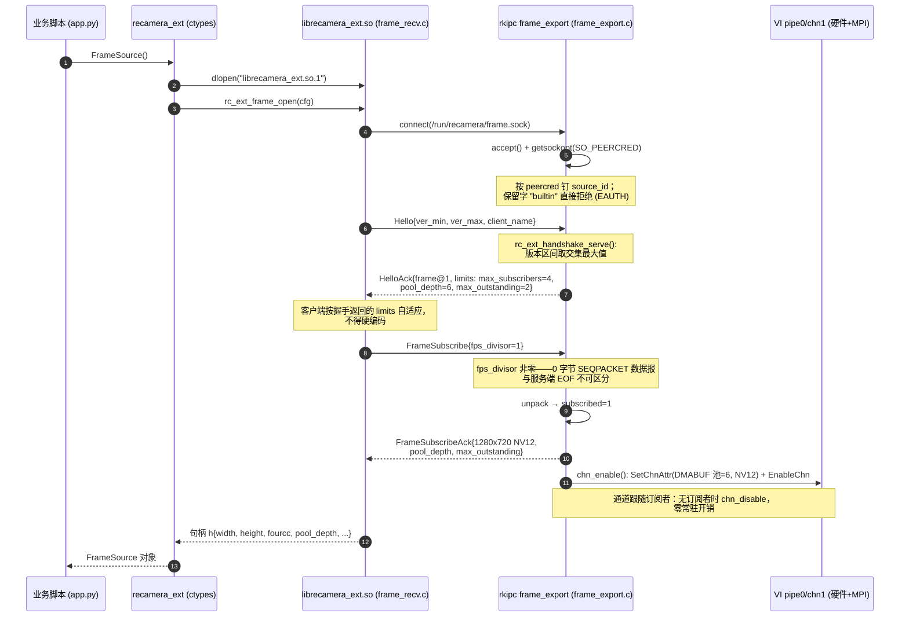
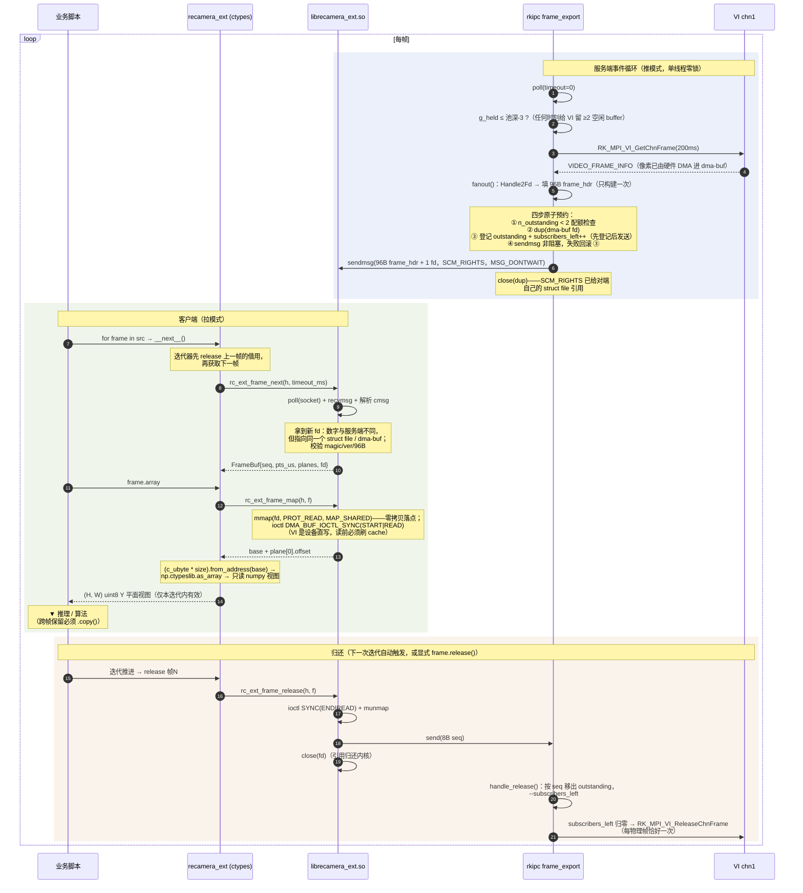
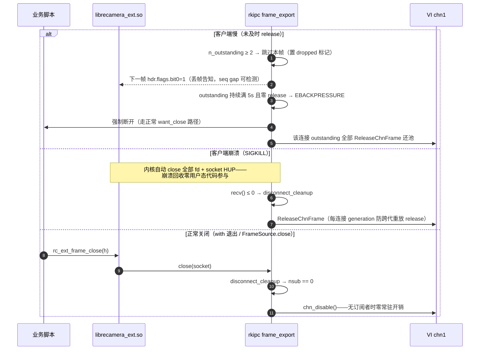

# frame.sock 交互时序（rkipc ↔ librecamera_ext ↔ Python）

> 本文把帧代理通路的完整交互画成 Mermaid 时序图，作为
> [`architecture.md`](./architecture.md) §4.1（帧代理数据流）与 `spec.md` §2
> 的配套图示。所有步骤的代码出处标注在各节末尾；行号以当前工作树为准。

参与方（从左到右）：

| 参与方 | 实体 | 职责 |
|---|---|---|
| 业务脚本 | `app.py` / `examples/*` | `for frame in src` 消费帧，跑算法 |
| ctypes 层 | `sdk/python/recamera_ext/__init__.py` | `FrameSource` / `Frame`，借用迭代器 |
| native 库 | `sdk/src/frame_recv.c` → `librecamera_ext.so.1` | connect/握手/recvmsg/mmap/release |
| 服务端 | `recamera_ipc` `frame_export.c` 线程 | poll + 采集 + fan-out + 所有权状态机 |
| VI | pipe0/chn1（硬件 + Rockit MPI） | 帧写入私有 DMABUF 池（池深 6） |

跨进程传输的只有两条控制消息：**96 字节帧头 + 1 个 dma-buf fd**（SCM_RIGHTS）
和 **8 字节 release seq**。像素永远不进 socket——fd 两端的进程持有各自的
fd 数字，但指向同一个 `struct file` / 同一块物理内存（详见
`architecture.md` §5.5）。

---

## 1. 连接建立：握手 + 订阅（一次性）

代码出处：`frame_recv.c:79-153`（open + 订阅）、`frame_export.c:517-546`
（accept + 身份）、`:395-417`（握手分支）、`:419-436`（订阅分支）、
`:181-209`（chn_enable）。

---

## 2. 稳态：一帧的完整生命周期（无限循环）

服务端是**推**模式（自己的事件循环里采集并扇出），客户端是**拉**模式
（`rc_ext_frame_next` 里 poll + recvmsg）。两者靠 SEQPACKET 队列解耦。

代码出处：采集与预算 `frame_export.c:612-618`、`:63`（`FE_HELD_CAP`）；
fanout 四步 `:281-374`；接收 `frame_recv.c:172-219`；mmap + cache sync
`:221-237`；numpy 包装 `__init__.py:2105-2141`、`array` `:2153-2171`；
归还 `frame_recv.c:239-256` → `frame_export.c:249-261`（release）、
`:162-170`（`rec_release`）。

---

## 3. 背压、异常与关闭（旁路）

代码出处：背压 `frame_export.c:74`（5s 超时）、`:326-331`（满额丢帧）、
`:584-596`（收割）；崩溃清理 `:263-278`；通道跟随订阅 `:604-609`。

---

## 4. 线上消息汇总

| 方向 | 消息 | 大小 | 载体 |
|---|---|---|---|
| client → rkipc | Hello | protobuf | SEQPACKET |
| rkipc → client | HelloAck（frame@1 + limits） | protobuf | SEQPACKET |
| client → rkipc | FrameSubscribe{fps_divisor} | protobuf | SEQPACKET |
| rkipc → client | FrameSubscribeAck{几何/池深/配额} | protobuf | SEQPACKET |
| rkipc → client | **帧头 + dma-buf fd** | **96 B + 1 fd** | SEQPACKET + SCM_RIGHTS |
| client → rkipc | **release seq** | **8 B** | SEQPACKET |

约束速查（详见 `spec.md` §2 与 `AGENTS.md` 核心约定）：

- 96 B 帧头 `_Static_assert(sizeof==96)`，FROZEN，演进走 `ver` + `reserved[16]`；
  plane 的 `offset/stride/vstride` 按服务端实际分配填写，客户端禁止按宽高推导。
- `pts_us` 与 VI `u64PTS` 同源（CLOCK_MONOTONIC 微秒），结果注入
  `result-in.sock` 传同一时钟的 `pts_us` 可让 OSD 按帧对齐叠加。
- 每连接 ≤ 2 帧在途（outstanding）+ 全局 `held ≤ 池深-3`；发送永不阻塞，
  `EAGAIN` 丢帧置 `flags.bit0`；`source_id="builtin"` 保留字拒绝。
- 借用迭代器保证"下一迭代自动归还"；泄漏帧由 GC 终结器兜底 release
  （`__init__.py:2233`），release 后访问抛 `BufferReleasedError`。
